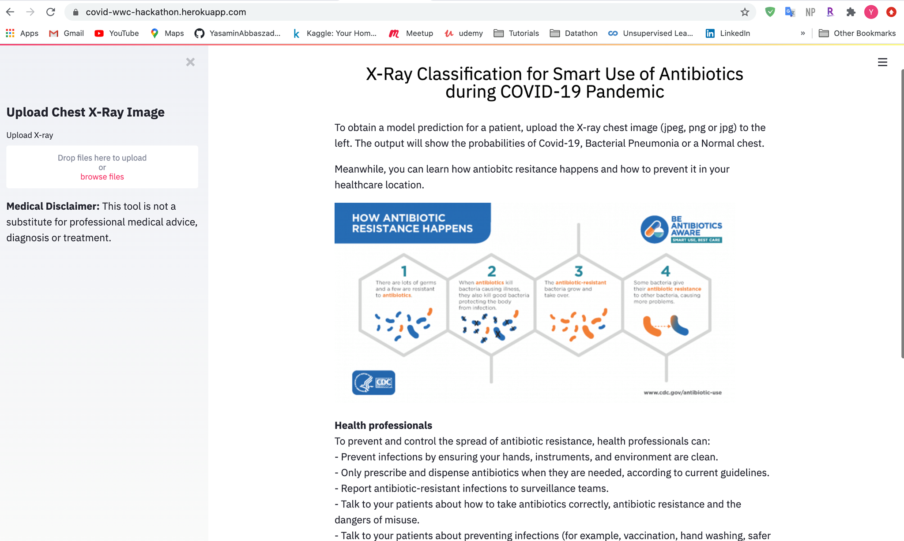
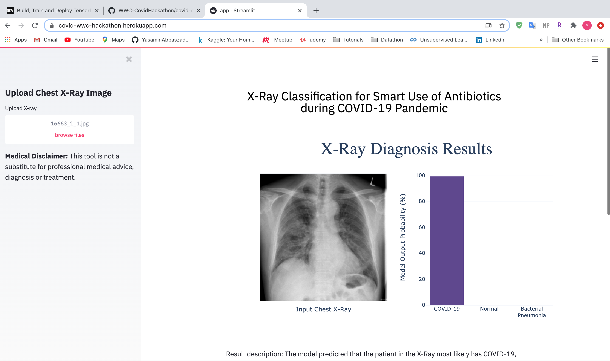

# covid-detection
**WomenWhoCode Hackathon Covid Detection and Antibiotic Resistance Prevention application.** 
To run the application clone the repository and run the following command
### **streamlit run app.py** 
The application can be found **<a href="https://covid-wwc-hackathon.herokuapp.com/"> here</a>**.

 
 
